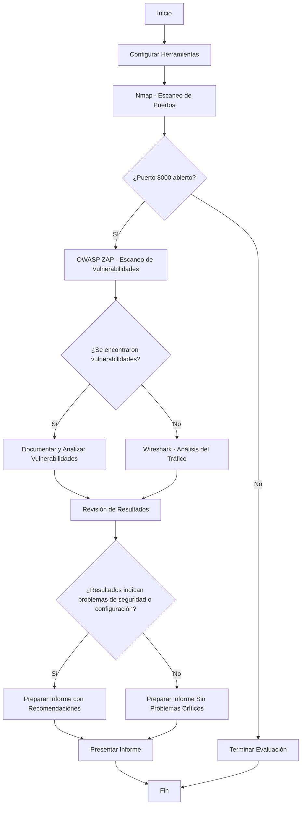
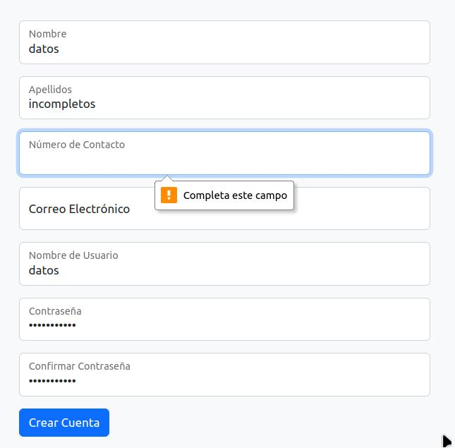
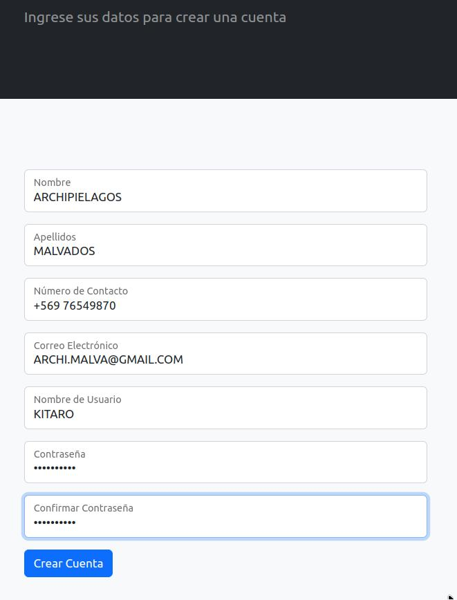
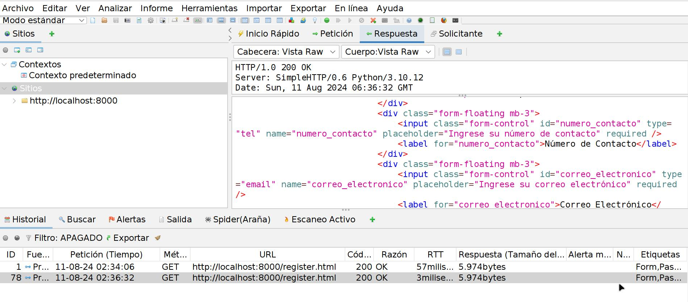
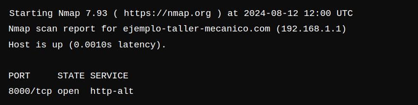
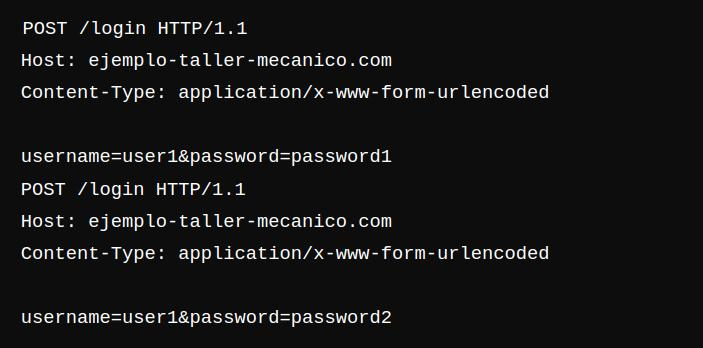

<div style="max-width: 600px; margin: auto;">
</div>


# Evaluación de Seguridad a Garras y Tuercas (App WEB)


| Cargo                       | Nombre                        | E-mail                             |
|-----------------------------|-------------------------------|------------------------------------|
| Gestora JR en Ciberseguridad | Dana Valdebenito Fuentes      | Danavaldebenitofuentes@gmail.com   |


## Introducción:

En el presente informe se realiza una evaluación y prueba de pentesting a la aplicación de taller mecánico Garras y Tuercas para evaluar ls seguridad del sistema y verificación del resguardo de los datos al hacer uso de la plataforma.

## Objetivos:

 ### 1.-  Verificar que los puntos de acceso son seguros:
 Para este objetovo se realizaran pruebas de ingreso a través del uso de diferentes métodos de verificación de usuarios para establecer que las políticas y protocolos de ingreso se cumplen en el funcionamiento del uso de la plataforma.

 ### 2.- Establecer la seguridad de la página en relación a la conexión con la base de datos y sus servidores:

 Se realiza evaluación de la conexión y transmisión de datos de la página a través de la plataforma de OWAS-ZAP para determinar que la página no posea puntos de vulnerabilidad evidentes.

### 3.- Determinar y evaluar la existencia de vulnerabilidades dentro del mismo entorno de la página a través de diferentes metodologías de tipos de acceso como:

-  Ataques de fuerza bruta
- Suplantación de identidad o intento de ingreso mediante usuarios falsos.

(a continuación una muestra de dos herramientas para evaluación de puertos y escaneo de redes, a modo de ejemplo de ejecución de la evaluación posterior)
  

(figura 1)

## Metodologías de evaluación:

### Para objetivo N°1:

#### 1.1 INGRESO DE DATOS AL AZAR:

Al ingresar datos incompletos la página arroja el siguiente mensaje:

(figura 2)



El mismo paso se repite con todos los campos dentro del requerimiento de datos

Lo que indica que existe una seguridad en cuanto a la verificación de la información completa para la generación de un "Post" de usuario nuevo para la base de datos del servidor.

#### 1.2 INGRESO DE DATOS FALSOS

Al hacer ingreso de datos falsos e intentando ingresarlos apretando "crear cuenta" a la página, se otorga el siguiente mensaje:

(figura 3)




### Para Objetivo N°2:

Se realiza una evaluación a través de escaneos con Owasp ZAP al servidor local lo que permite tener una copia del código madre de la aplicación, lo que puede significar una vulnerabilidad que abre puertas para la edición del código y generar ataques de "MIM, Man in the Middle" que le permitan a los atacantes copiar el código fuente de la aplicación.

(figura 4)


A través de nmap se realiza una evaluación del estado del puerto 8000 del 'localhost' que se estableció para poder verificar el estado en el que se encuentra:

(figura 5)



### Para objetivo N°3:

Se realiza una evaluación del tráfico de datos y de peticiones a la base de datos de tipo "POST" lo que se reconocería si es que llegan a ser en gran cantidad como un ataque de fuerza bruta como se muestra en la siguiente evidencia digital.

(figura 6)




### Conclusiones y Recomendaciones:

Es de suma importancia conocer cuales son los puertos y protocolos que se utilizan en las plataformas de desarrollo dentro de las cuales se contienen los datos a través de bases de datos para las cuales se realizan las 'llamadas' y que proporcionan la contención de los datos en el nucleo de la memoria de la plataforma y del sistema de redes, por consiguiente la configuración de las mismas desde que se genera el token de usuario o desde que se le otorgan atributos CRUD a los usuarios para manipular sus datos, hasta las configuraciones de firewall de software o de hardware para mantener la protección de los datos.

a continuación se presenta una recomendación/sugerencia de un diagrama de flujo para la configuración de las herramientas utilizadas que permiten mitigar las vulnerabilidades a las bases de datos.

(figura 7)

```mermaid
graph TD
    A[Inicio] --> B[Configurar Herramientas de Monitoreo]
    B --> C[Realizar Escaneo de Puertos]
    C --> D{¿Puertos abiertos no autorizados?}
    D -- Sí --> E[Actualizar Configuración de Firewall]
    D -- No --> F[Analizar Tráfico de Datos en Tiempo Real]
    E --> F
    F --> G[Detectar Anomalías en el Tráfico]
    G --> H{¿Se detectan anomalías?}
    H -- Sí --> I[Generar Alerta y Reporte]
    H -- No --> J[Continuar Monitoreo]
    I --> J
    J --> K[Revisar Configuración y Políticas de Seguridad]
    K --> L{¿Configurar Nuevas Políticas?}
    L -- Sí --> M[Actualizar Políticas de Seguridad]
    L -- No --> N[Revisar y Actualizar Herramientas]
    M --> N
    N --> O[Fin]
    O --> B
    


