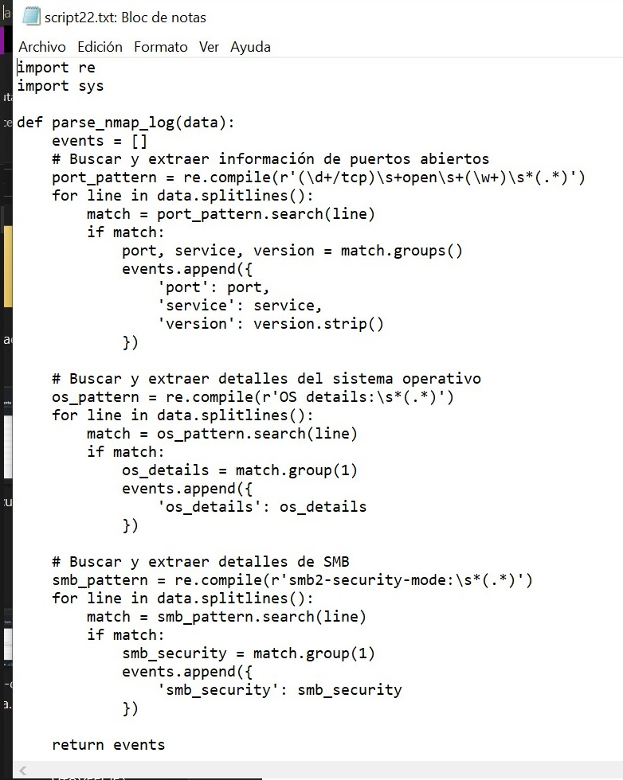
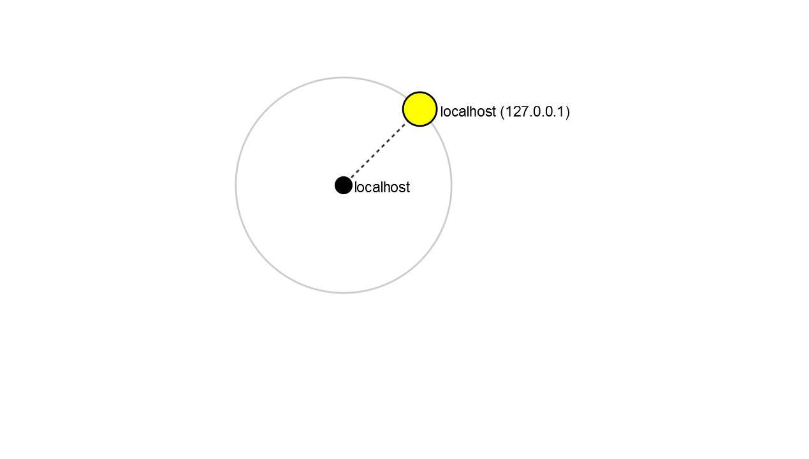
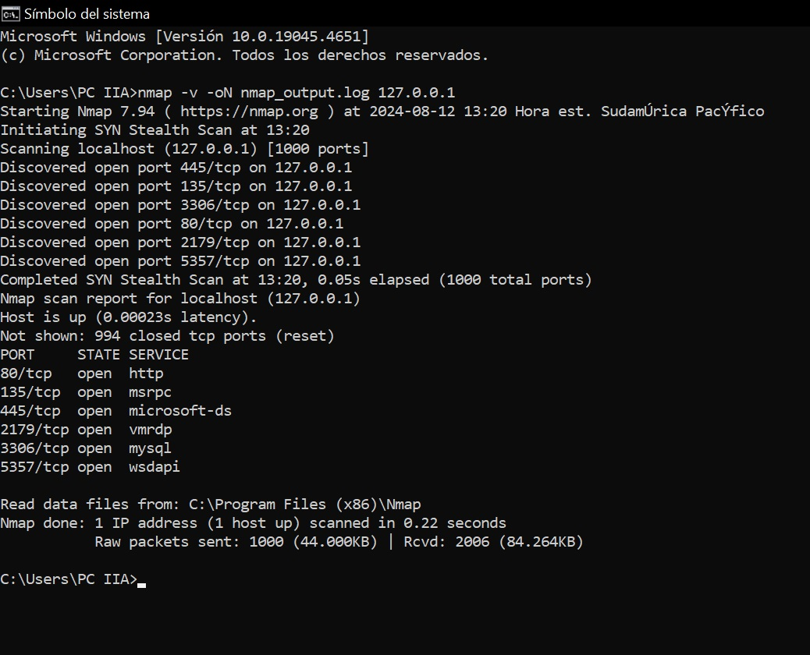
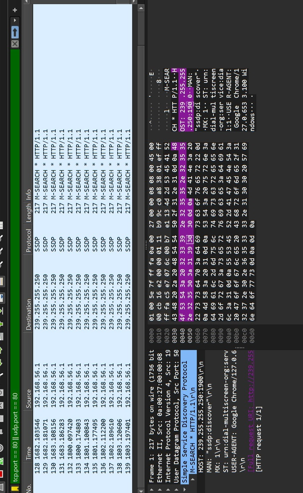
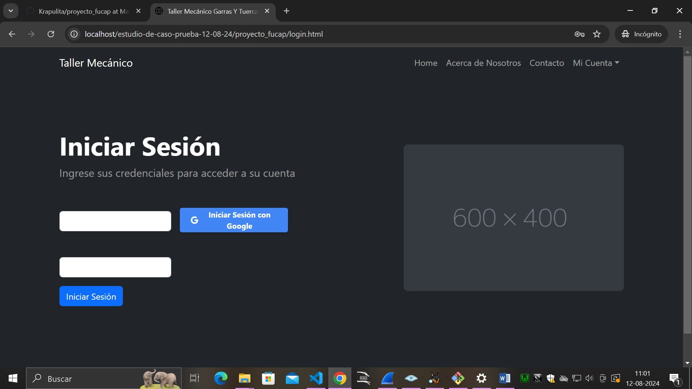
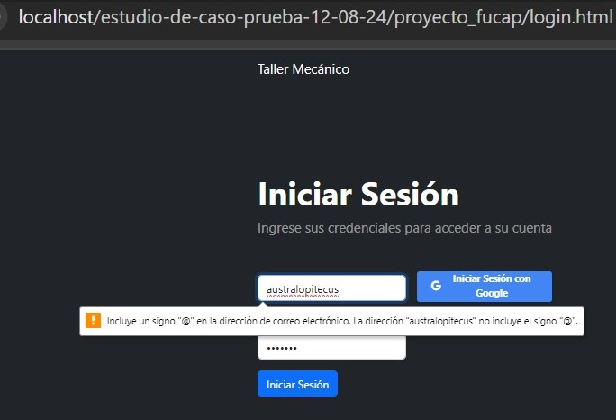
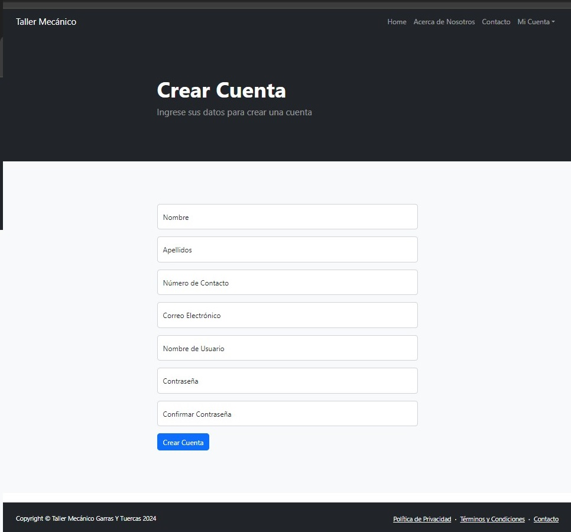
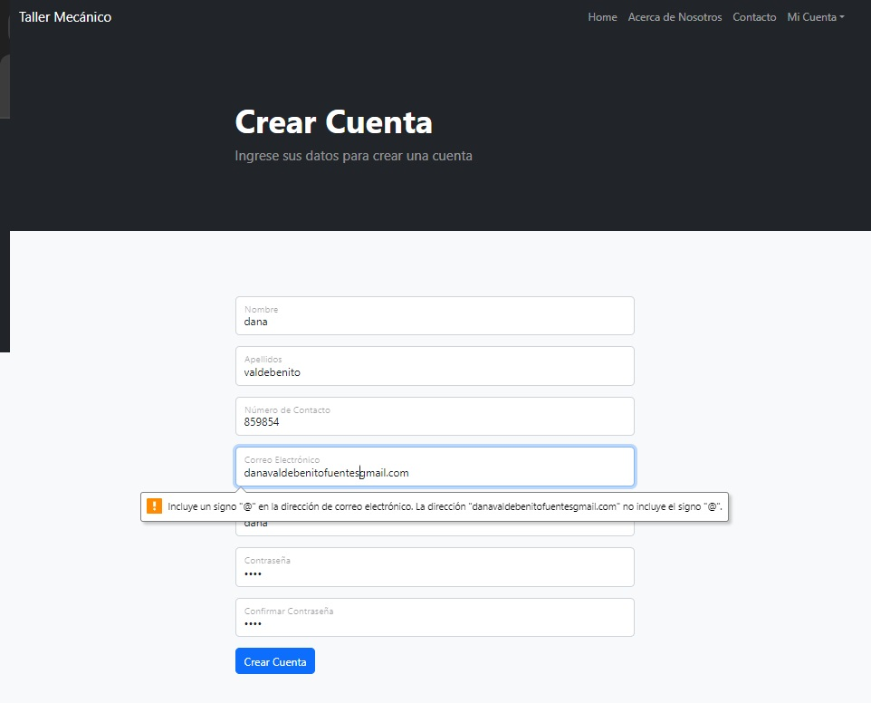

## Informe de Evaluación: Garras y Tuercas.

Gestora JR. de incidentes en Ciberseguridad: 

- Dana Valdebenito Fuentes.

Autoriza el informe de incidentes:

- Christopher Espinoza, Consultor TI.

### Resumen Ejecutivo.

Se realiza evaluaciòn del tràfico de red en búsqueda de vulnerabilidades al sitio de 'Garras y Tuercas' con el fin de tener un examen exahustivo de la configuración de la red y las posibles vulnerabilidades que se puedan presentar para la reconfiguración de los filtros de los firewall de ser necesario en caso de presentarse vulnerabilidades evidentes en el acceso a la plataforma.

### Introducción.

Para el presente informe se realiza una evaluación de las características manuales de conexión, para la evaluación de la capa 7 y el análisis de vulnerabilidades al logín de la plataforma, además se realiza análisis de los puertos y del tráfico de red de la página en servidor local para establecer posibles vulnerbilidades existentes, se utilizaràn herramientas como wireshark y Nmap

### Antecedentes del caso.

Se reconoce una conexión remota en la conexión al servidor local que podría estar generando vulnerabilidades en los datos de los usuarios de la plataforma, por lo que se hace necesario el establecimiento de un escaneo de los puertos, para verificar que las conexiones que existen dentro de la red no están siendo controladas desde una IP remota que pudiera estar controlando la conexión a internet.

### Objetivos del Análisis.
determinar las vulnerabilidades a trabajar dentro del proceso de levantamiento de la plataforma para establecer que los puntos de acceso estàn siendo ordenados.

## Herramientas utilizadas.

Análisis Manual de Ingreso a la Plataforma: 

Wireshark: Para el escaneo de conexión a los puertos del servidor local, y los tipos de Protocolos de transmisión de datos que se estén utilizando.

Nmap: Análisis de puertos y escaneo de conexiones a la red para evaluar vulnerabilidades.

## Procedimientos de adquisisión:
- se hace uso manual de la plataforma para comprobar puntos de acceso.

- Se realiza un análisis del tráfico de datos a través de filtros de protocolos utilizando Wireshark para deteción de protocolos TCP-UDP.

- Se realiza escaneo de los tipos de conexiones a la red local a través de Nmap.

## Técnicas de análisis:
Escaneo de los puertos de conexión desde el localhost.

### Metodología.

Nmap: se crea un script de Python para obtener archivos log del escaneo de puertos a través del siguiente comando.

## Evidencia Digital:

Se establece la conexión de local-host y se reitera que existe solamente una conexión.

Se realiza filtro de tráfico de TCP-UDP para el análisis de las conexiones.

Se establece el uso correcto de la plataforma evaluando el ingreso.

Se establece el uso de la pagina de manera normal

Se hace uso de la plataforma a nivel local.

se verifica que el usuario debe ser válido para poder hacer uso de la plataforma.

## Posibles vectores de ataque:
- Al no tener protocolos de protección dentro del servidor local y actuar desde una configuración por defecto de la apertura y uso de los puertos, es más fácil descifrar cuales las acciones predeterminadas que pudiera tener un atacante para lograr tener acceso remoto del equipo y adjudicarse el control del mismo.

### Conclusiones:

Se concluye que para las conexiones con servidores desde Chile-México, se necesitará de configuraciones que permitan mantener los datos estructurados y particionados dentro de los canales de buses de datos para poder mitigar el uso por defecto de los buses de datos y de esta manera otorgar una configuración eficiente para el desarrollo de las conexiones y la estabilidad de las mismas.

